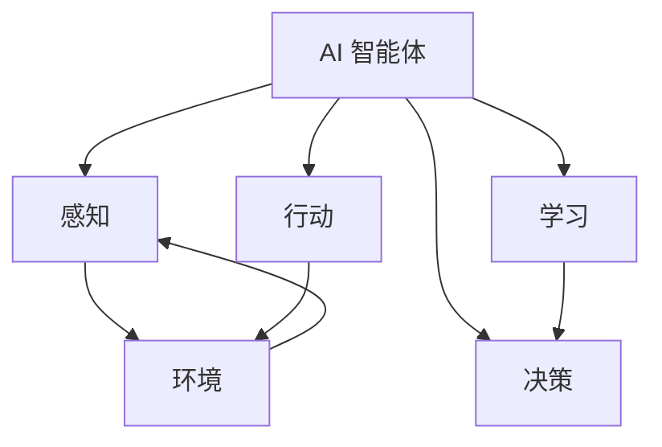

# AI 智能体（智能 AI）技术文档

## 目录
- [简介](#简介)
- [定义和关键特性](#定义和关键特性)
- [常见架构和框架](#常见架构和框架)
- [核心组件](#核心组件)
- [实现方法和最佳实践](#实现方法和最佳实践)
- [当前限制和挑战](#当前限制和挑战)
- [实际应用和示例](#实际应用和示例)
- [AI 智能体框架的竞争性分析](#ai-智能体框架的竞争性分析)
- [参考文献](#参考文献)

## 简介

人工智能（AI）智能体，也称为智能 AI，代表了人工智能领域的重大进步。与为特定任务设计的传统 AI 系统不同，AI 智能体是能够感知环境、做出决策并采取行动以实现目标的自主系统。本技术文档提供了 AI 智能体的全面概述，涵盖其定义、架构、组件、实现方法、限制和实际应用。

## 定义和关键特性

AI 智能体（或智能体）是一个自主实体，通过传感器观察环境，基于这些观察做出决策，并对环境采取行动以实现特定目标。

### 关键特性：

1. **自主性**：智能体无需直接人类干预即可运行，基于其编程和学习独立做出决策。

2. **感知**：智能体通过各种输入（传感器、数据源、API 调用等）感知环境。

3. **决策**：智能体处理信息并做出决策以实现目标。

4. **行动**：智能体执行影响环境的行动。

5. **目标导向**：智能体设计用于实现特定目标或优化特定指标。

6. **适应性**：高级智能体能够从经验中学习并随时间调整行为。

7. **反应性**：智能体及时响应环境变化。

8. **主动性**：智能体可以主动采取行动并展示目标导向行为。


## 常见架构和框架

AI 智能体可以使用各种架构和框架实现，每种架构和框架都有其优势和应用场景。

### 1. 反应式智能体

反应式智能体基于简单的刺激-响应模型运行，不维护内部状态或过去行动的记忆。它们将特定情况直接映射到行动。

**示例**：机器人中的简单反射智能体，对传感器输入做出预定义的行动响应。

### 2. 深思熟虑的智能体

深思熟虑的智能体维护世界的内部模型，并使用规划算法决定行动。它们在执行前考虑潜在行动的后果。

**示例**：下棋 AI，在选择最佳行动前评估多种可能的移动。

### 3. BDI（信念-欲望-意图）架构

BDI 架构模型智能体具有：
- **信念**：智能体关于环境的信息
- **欲望**：智能体想要实现的目标
- **意图**：对特定行动计划的承诺

**示例**：虚拟助手，维护关于用户偏好的信念，有满足用户请求的欲望，并形成执行特定行动序列的意图。

### 4. 大型语言模型驱动的智能体

大型语言模型（LLM）驱动的智能体使用基础模型作为核心控制器，辅以规划、记忆和工具使用的额外组件。

**示例**：使用 LLM 驱动自主智能体的框架，如 LangChain、AutoGPT 和 BabyAGI。

```python
# 使用 LangChain 的简单 LLM 驱动智能体示例
from langchain.agents import Tool, AgentExecutor, LLMSingleActionAgent
from langchain.prompts import StringPromptTemplate
from langchain_openai import OpenAI

# 定义智能体可以使用的工具
tools = [
    Tool(
        name="Search",
        func=lambda x: "search results for: " + x,
        description="useful for searching information"
    ),
    Tool(
        name="Calculator",
        func=lambda x: eval(x),
        description="useful for performing calculations"
    )
]

# 定义智能体提示
template = """
你是一个 AI 助手。你可以使用以下工具：

{tools}

使用以下格式：
问题：输入问题
思考：你应该始终思考要做什么
行动：要采取的行动，应该是 [{tool_names}] 之一
行动输入：行动的输入
观察：行动的结果
...（这个思考/行动/行动输入/观察可以重复 N 次）
思考：我现在知道最终答案
最终答案：对原始输入问题的最终答案

问题：{input}
思考：
"""

# 初始化 LLM
llm = OpenAI(temperature=0)

# 创建智能体
agent = LLMSingleActionAgent(
    llm_chain=llm,
    prompt=StringPromptTemplate.from_template(template),
    tools=tools,
    verbose=True
)

# 创建智能体执行器
agent_executor = AgentExecutor.from_agent_and_tools(
    agent=agent,
    tools=tools,
    verbose=True
)

# 运行智能体
agent_executor.run("法国的首都是什么？")
```

### 5. 多智能体系统

多智能体系统由多个交互智能体组成，它们协作或竞争以解决复杂问题。

**示例**：交通模拟系统，其中每个车辆都被建模为一个智能体，与其他车辆和环境交互。
## 核心组件

现代 AI 智能体，尤其是由 LLM 驱动的智能体，通常由几个核心组件组成，这些组件使其功能成为可能。

### 规划

规划是智能体确定一系列行动以实现目标的过程。它涉及将复杂任务分解为可管理的子任务，并创建执行路线图。

#### 规划类型：

1. **任务分解**：将复杂任务分解为更小、可管理的子任务。

2. **顺序规划**：创建实现目标的线性行动序列。

3. **层次规划**：以层次结构组织计划，高级目标分解为低级行动。

4. **反思规划**：基于反馈和自我批评评估和完善计划的能力。

```python
# LLM 驱动智能体中的任务分解示例
def decompose_task(llm, task):
    prompt = f"""
    将以下任务分解为更小、可管理的子任务：
    任务：{task}
    
    将你的回答格式化为子任务的编号列表。
    """
    response = llm(prompt)
    return parse_subtasks(response)
```

### 记忆

记忆系统允许智能体随时间存储和检索信息，使其能够从过去的经验中学习并在交互过程中保持上下文。

#### 记忆类型：

1. **短期记忆**：与当前任务或对话相关的信息的临时存储。

2. **长期记忆**：可在多个会话或任务中访问的信息的持久存储。

3. **情景记忆**：存储智能体以后可以参考的特定经验或交互。

4. **语义记忆**：存储关于世界的一般知识和事实。

```python
# 实现简单的基于向量的记忆系统示例
from langchain.vectorstores import FAISS
from langchain.embeddings import OpenAIEmbeddings

class AgentMemory:
    def __init__(self):
        self.embeddings = OpenAIEmbeddings()
        self.vector_store = FAISS.from_texts([], self.embeddings)
        
    def add_memory(self, text):
        self.vector_store.add_texts([text])
        
    def retrieve_relevant_memories(self, query, k=5):
        return self.vector_store.similarity_search(query, k=k)
```

### 工具使用

工具使用指的是智能体与外部系统、API 或函数交互的能力，以扩展其核心模型之外的能力。

#### 常见工具：

1. **搜索引擎**：从网络访问最新信息。

2. **计算器**：执行精确的数学计算。

3. **API**：与外部服务和数据库交互。

4. **代码执行**：运行代码以执行复杂操作或数据分析。

5. **文件操作**：读取和写入文件。

```python
# 为智能体定义工具示例
from langchain.agents import Tool
from langchain.tools import BaseTool

# 定义自定义工具
class WeatherTool(BaseTool):
    name = "weather_tool"
    description = "用于获取位置的天气信息"
    
    def _run(self, location: str) -> str:
        # 在实际实现中，这将调用天气 API
        return f"{location} 的天气晴朗，温度为 22°C"
        
    def _arun(self, location: str) -> str:
        # 异步实现
        return self._run(location)

# 创建工具列表
tools = [
    WeatherTool(),
    Tool(
        name="Calculator",
        func=lambda x: eval(x),
        description="用于执行数学计算"
    )
]
```

### 感知

感知是智能体通过各种输入解释和理解环境的能力。

#### 感知机制：

1. **文本理解**：处理和理解自然语言输入。

2. **图像识别**：解释视觉数据（对于多模态智能体）。

3. **传感器数据处理**：解释来自虚拟或物理传感器的数据。

4. **上下文感知**：理解环境和对话的当前状态。

### 行动

行动指的是智能体执行影响环境或产生输出的操作的能力。

#### 行动类型：

1. **文本生成**：产生自然语言响应。

2. **工具调用**：调用外部工具或 API。

3. **决策**：从多种可能的行动中选择。

4. **物理行动**：控制机器人组件（在具身智能体中）。
## 实现方法和最佳实践

### 实现方法

#### 1. 基于规则的智能体

基于规则的智能体遵循预定义的规则和启发式方法来做出决策和采取行动。

**优点**：
- 行为可预测
- 决策透明
- 不需要训练数据

**缺点**：
- 灵活性有限
- 难以处理未预见的情况
- 需要手动创建和维护规则

#### 2. 基于学习的智能体

基于学习的智能体使用机器学习技术随时间提高性能。

**优点**：
- 可以适应新情况
- 随经验提高
- 可以处理复杂环境

**缺点**：
- 需要训练数据
- 可能表现出不可预测的行为
- 黑盒决策

#### 3. 混合方法

混合方法结合了基于规则和基于学习的方法，以利用两者的优势。

**优点**：
- 可预测性和适应性之间的平衡
- 可以纳入领域知识
- 比纯方法更健壮

**缺点**：
- 实现更复杂
- 需要仔细整合组件

### 最佳实践

#### 1. 智能体设计

- **明确目标定义**：为智能体定义具体、可衡量的目标。
- **模块化架构**：设计具有可独立更新或替换的模块化组件的智能体。
- **适当的复杂性**：将智能体的复杂性与任务要求相匹配。

#### 2. 安全和控制

- **有界行动空间**：限制智能体可以采取的行动，以防止有害行为。
- **人类监督**：实施人类审查和干预机制。
- **优雅失败**：设计智能体在遇到意外情况时安全失败。

#### 3. 评估和测试

- **全面测试**：在广泛的场景中测试智能体。
- **持续评估**：根据既定指标定期评估智能体性能。
- **对抗性测试**：针对对抗性输入测试智能体，以识别漏洞。

#### 4. 实现示例

```python
# 模块化智能体实现示例
class ModularAgent:
    def __init__(self, llm, tools, memory_system, planner):
        self.llm = llm
        self.tools = tools
        self.memory = memory_system
        self.planner = planner
        
    def process_input(self, user_input):
        # 检索相关记忆
        relevant_memories = self.memory.retrieve_relevant_memories(user_input)
        
        # 创建计划
        plan = self.planner.create_plan(user_input, relevant_memories)
        
        # 执行计划
        result = self.execute_plan(plan)
        
        # 更新记忆
        self.memory.add_memory(f"用户: {user_input}\n智能体: {result}")
        
        return result
        
    def execute_plan(self, plan):
        results = []
        for step in plan:
            if step["type"] == "tool_use":
                tool_name = step["tool"]
                tool_input = step["input"]
                tool = next(t for t in self.tools if t.name == tool_name)
                result = tool.run(tool_input)
                results.append(result)
            elif step["type"] == "llm_generation":
                prompt = step["prompt"]
                result = self.llm(prompt)
                results.append(result)
        
        # 综合结果
        final_result = self.synthesize_results(results)
        return final_result
        
    def synthesize_results(self, results):
        # 将结果组合成连贯的响应
        prompt = f"将以下信息综合成连贯的响应:\n{results}"
        return self.llm(prompt)
```
## 当前限制和挑战

尽管取得了重大进展，AI 智能体仍面临几个限制和挑战：

### 1. 推理限制

- **逻辑推理**：智能体可能难以处理复杂的逻辑推理任务。
- **因果推理**：理解因果关系仍然具有挑战性。
- **反事实推理**：对假设场景的推理很困难。

### 2. 知识限制

- **知识截止**：基于 LLM 的智能体有知识截止，可能缺乏最新信息。
- **领域专业知识**：智能体可能缺乏专业领域的深度专业知识。
- **常识**：智能体通常缺乏类人的常识推理。

### 3. 规划和执行挑战

- **长期规划**：在延长的时间范围内进行规划具有挑战性。
- **计划适应**：响应不断变化的情况调整计划可能很困难。
- **错误恢复**：在计划执行过程中从错误中恢复仍然具有挑战性。

### 4. 伦理和安全问题

- **一致性**：确保智能体按照人类价值观和意图行动。
- **透明度**：理解智能体决策过程。
- **安全性**：防止智能体漏洞被利用。
- **偏见**：减轻智能体行为和输出中的偏见。

### 5. 技术挑战

- **计算效率**：智能体，尤其是基于 LLM 的智能体，可能在计算上很昂贵。
- **集成复杂性**：集成多个组件和工具可能很复杂。
- **评估指标**：开发全面的指标来评估智能体性能。

## 实际应用和示例

AI 智能体正在各个领域应用，展示其多功能性和潜力：

### 1. 虚拟助手

**示例**：
- **个人助手**：Siri、Alexa 和 Google Assistant 使用类似智能体的架构来理解和响应用户请求。
- **企业助手**：在商业环境中帮助安排日程、管理电子邮件和检索信息的 AI 智能体。

### 2. 客户服务

**示例**：
- **客户支持聊天机器人**：处理客户查询、解决问题并将复杂问题路由到人类代理的智能体。
- **销售助手**：引导客户完成产品选择和购买过程的智能体。

### 3. 软件开发

**示例**：
- **代码助手**：GitHub Copilot 和类似工具，协助开发人员进行代码生成和调试。
- **DevOps 智能体**：自动化部署、监控和维护任务的智能体。

### 4. 研究和数据分析

**示例**：
- **研究助手**：帮助研究人员搜索文献、分析数据和生成假设的智能体。
- **数据分析智能体**：自动化数据清理、分析和可视化任务的智能体。

### 5. 医疗保健

**示例**：
- **诊断助手**：帮助医疗提供者根据症状和病史诊断疾病的智能体。
- **治疗规划**：协助制定个性化治疗计划的智能体。

### 6. 教育

**示例**：
- **辅导系统**：为学生提供个性化指导和反馈的智能体。
- **教育内容创建**：生成针对特定学习目标的教育材料的智能体。

### 7. 实现示例：AutoGPT

AutoGPT 是一个实验性开源应用程序，展示了自主 GPT-4 操作。它将 LLM 调用链接在一起，自主实现用户定义的目标。

```python
# AutoGPT 类智能体的简化概念实现
class AutoGPTAgent:
    def __init__(self, llm, tools, memory_system):
        self.llm = llm
        self.tools = tools
        self.memory = memory_system
        self.goals = []
        
    def set_goals(self, goals):
        self.goals = goals
        
    def run(self, max_iterations=10):
        for i in range(max_iterations):
            # 检索相关记忆
            relevant_memories = self.memory.get_relevant_memories(self.goals)
            
            # 生成关于当前状态和目标的思考
            thoughts = self.generate_thoughts(relevant_memories)
            
            # 决定下一步行动
            action = self.decide_action(thoughts)
            
            # 执行行动
            result = self.execute_action(action)
            
            # 更新记忆
            self.memory.add_memory(f"迭代 {i}: 行动: {action}, 结果: {result}")
            
            # 检查目标是否已实现
            if self.check_goals_achieved():
                break
                
    def generate_thoughts(self, memories):
        prompt = f"""
        目标: {self.goals}
        
        相关记忆:
        {memories}
        
        生成关于当前状态以及如何朝着目标前进的思考。
        """
        return self.llm(prompt)
        
    def decide_action(self, thoughts):
        prompt = f"""
        目标: {self.goals}
        
        思考: {thoughts}
        
        可用工具: {[tool.name for tool in self.tools]}
        
        决定下一步要采取的行动。指定要使用的工具和该工具的输入。
        """
        response = self.llm(prompt)
        # 解析响应以提取工具名称和输入
        # 这是一个简化的实现
        return {"tool": "example_tool", "input": "example_input"}
        
    def execute_action(self, action):
        tool = next(t for t in self.tools if t.name == action["tool"])
        return tool.run(action["input"])
        
    def check_goals_achieved(self):
        prompt = f"""
        目标: {self.goals}
        
        记忆摘要: {self.memory.summarize()}
        
        所有目标都已实现了吗？回答是或否。
        """
        response = self.llm(prompt)
        return "是" in response.lower()
```
## AI 智能体框架的竞争性分析

本节提供了主要 AI 智能体框架的比较分析，突出它们的优势、劣势和用例，以帮助开发人员选择最适合其特定需求的框架。

### LangChain

**描述**：一个用于开发由大型语言模型（LLM）驱动的应用程序的框架。

**主要特性**：
- 用于构建具有一流流式处理支持的有状态智能体的组件
- 人在循环能力
- 与外部工具和服务的广泛集成
- 用于有状态智能体工作流的 LangGraph

**优势**：
- 简化 LLM 应用程序生命周期的每个阶段
- 与各种数据源和工具的广泛集成
- 具有监控和部署选项的生产就绪
- 强大的社区支持和文档

**用例**：
- LLM 应用程序的开发、产品化和部署
- 需要强大集成能力的企业应用
- 需要人类监督和干预的应用

**架构**：具有 LangGraph 的模块化架构，用于有状态智能体工作流，允许复杂的智能体行为，同时保持开发人员控制。

### AutoGPT

**描述**：基于 LLM 构建的自主 AI 智能体，愿景是为每个人提供可访问的 AI。

**主要特性**：
- 最小人类干预的自主操作
- 目标导向的任务执行
- 用于上下文保留的记忆管理
- 自我提示能力

**优势**：
- 开源，拥有庞大社区（GitHub 上 173K+ 星）
- 高度自主操作
- 灵活的目标设置能力
- 活跃的社区开发

**用例**：
- 最小监督的自主任务完成
- 创意内容生成
- 研究和数据分析任务

**架构**：具有规划和执行能力的自主智能体架构，设计用于最小人类指导的独立操作。

### DeepSeek

**描述**：专注于代码生成和理解的开源推理模型。

**主要特性**：
- 代码补全和生成
- 代码理解和分析
- 用于商业用途的 MIT 许可证

**优势**：
- 专门用于编码任务
- 开源，具有宽松的许可
- 在代码相关基准上表现强劲

**用例**：
- 软件开发辅助
- 代码生成和补全
- 编程教育和培训

**架构**：针对代码理解和生成优化的基于 Transformer 的模型，具有针对编程语言的专门标记化和训练。

### CrewAI

**描述**：用于编排在复杂任务上协作的角色扮演、自主 AI 智能体的框架。

**主要特性**：
- 多个智能体之间的协作智能
- 基于角色的智能体专业化
- 通过智能体合作处理复杂任务
- 无缝智能体交互

**优势**：
- 专为多智能体协作设计
- 直观的基于角色的框架
- 快速增长的社区（28K+ 星）
- 简化的智能体交互模式

**用例**：
- 需要多个专业智能体的复杂工作流
- 具有不同角色和责任的业务流程
- 需要多样化视角的研究和分析

**架构**：基于角色的智能体框架，具有协作任务执行，使多个智能体能够共同解决复杂问题。

### Microsoft AutoGen

**描述**：一个具有多智能体对话能力的智能 AI 编程框架。

**主要特性**：
- 具有不同角色的对话智能体
- 可定制的工作流和智能体行为
- 企业集成能力
- 广泛的文档和示例

**优势**：
- 微软的支持和支持
- 具有安全特性的企业就绪
- 广泛的文档
- 活跃的开发社区（41K+ 星）

**用例**：
- 需要强大安全性的企业应用
- 通过智能体对话的复杂推理任务
- 需要可定制智能体行为的应用

**架构**：基于对话的多智能体框架，通过专业智能体之间的结构化对话解决复杂问题。

### OpenAI Evals

**描述**：用于评估 LLM 和 LLM 系统的框架，具有开源基准注册表。

**主要特性**：
- 标准化评估方法
- 用于一致比较的基准注册表
- 全面的评估指标

**优势**：
- 由 OpenAI 支持，具有行业标准指标
- 全面的评估能力
- 开源的基准测试方法

**用例**：
- LLM 性能测试和比较
- 部署前的模型评估
- 关于 LLM 能力和限制的研究

**架构**：具有标准化指标的评估框架，用于评估 LLM 和智能体在各个维度上的性能。

### 比较分析

在选择 AI 智能体框架时，请考虑以下维度：

**自主性谱系**：
- AutoGPT 提供最高级别的自主性，几乎不需要人类干预
- LangChain 和 Microsoft AutoGen 提供更多的开发人员控制和人在循环选项

**协作能力**：
- CrewAI 和 Microsoft AutoGen 在多智能体协作方面表现最佳
- LangChain 通过 LangGraph 提供良好的智能体编排

**企业就绪性**：
- Microsoft AutoGen 和 LangChain 提供最强的企业功能和安全控制
- OpenAI Evals 提供企业级评估能力

**社区采用**：
- AutoGPT 拥有最大的开源社区
- LangChain 在专业开发人员中拥有广泛的采用

**专业化**：
- DeepSeek 专注于代码生成和理解
- CrewAI 专注于基于角色的协作
- OpenAI Evals 专注于评估和基准测试

**开发速度**：
- LangChain 和 Microsoft AutoGen 拥有最活跃的开发团队
- AutoGPT 和 CrewAI 拥有快速增长的贡献者社区

**集成生态系统**：
- LangChain 提供最广泛的集成
- Microsoft AutoGen 提供强大的微软生态系统集成

**学习曲线**：
- CrewAI 提供最简单的入门体验
- LangChain 和 Microsoft AutoGen 需要更多的初始学习投资

## 参考文献

1. Weng, L. (2023). LLM Powered Autonomous Agents. Lil'Log. https://lilianweng.github.io/posts/2023-06-23-agent/

2. Xi, Y., et al. (2023). The Rise and Potential of Large Language Model Based Agents: A Survey. arXiv preprint arXiv:2309.07864.

3. LangChain 文档. https://python.langchain.com/docs/get_started/introduction

4. AutoGPT GitHub 仓库. https://github.com/Significant-Gravitas/AutoGPT

5. CrewAI 文档. https://docs.crewai.com/

6. Microsoft AutoGen 文档. https://microsoft.github.io/autogen/

7. OpenAI Evals GitHub 仓库. https://github.com/openai/evals

8. WooooDyy/LLM-Agent-Paper-List. https://github.com/WooooDyy/LLM-Agent-Paper-List

9. Hugging Face 博客: 构建 LLM 驱动的自主智能体. https://huggingface.co/blog/llm-agents

10. DeepSeek 文档. https://github.com/deepseek-ai/DeepSeek-Coder
