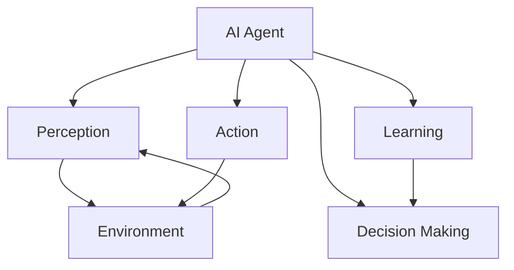

# AI Agents (Agentic AI): Technical Documentation

## Table of Contents
- [Introduction](#introduction)
- [Definition and Key Characteristics](#definition-and-key-characteristics)
- [Common Architectures and Frameworks](#common-architectures-and-frameworks)
- [Core Components](#core-components)
  - [Planning](#planning)
  - [Memory](#memory)
  - [Tool Use](#tool-use)
  - [Perception](#perception)
  - [Action](#action)
- [Implementation Approaches and Best Practices](#implementation-approaches-and-best-practices)
- [Current Limitations and Challenges](#current-limitations-and-challenges)
- [Real-World Applications and Examples](#real-world-applications-and-examples)
- [References](#references)

## Introduction

Artificial Intelligence (AI) agents, also known as Agentic AI, represent a significant advancement in the field of artificial intelligence. Unlike traditional AI systems that are designed for specific tasks, AI agents are autonomous systems capable of perceiving their environment, making decisions, and taking actions to achieve goals. This technical documentation provides a comprehensive overview of AI agents, covering their definition, architectures, components, implementation approaches, limitations, and real-world applications.

## Definition and Key Characteristics

An AI agent (or intelligent agent) is an autonomous entity that observes its environment through sensors, makes decisions based on those observations, and acts upon the environment to achieve specific goals. 

### Key Characteristics:

1. **Autonomy**: Agents operate without direct human intervention, making decisions independently based on their programming and learning.

2. **Perception**: Agents perceive their environment through various inputs (sensors, data feeds, API calls, etc.).

3. **Decision-making**: Agents process information and make decisions to achieve their goals.

4. **Action**: Agents execute actions that affect their environment.

5. **Goal-orientation**: Agents are designed to achieve specific objectives or optimize certain metrics.

6. **Adaptability**: Advanced agents can learn from experience and adapt their behavior over time.

7. **Reactivity**: Agents respond to changes in their environment in a timely manner.

8. **Proactivity**: Agents can take initiative and exhibit goal-directed behavior.



## Common Architectures and Frameworks

AI agents can be implemented using various architectures and frameworks, each with its own strengths and applications.

### 1. Reactive Agents

Reactive agents operate on a simple stimulus-response model without maintaining internal state or memory of past actions. They map specific situations directly to actions.

**Example**: Simple reflex agents in robotics that respond to sensor inputs with predefined actions.

### 2. Deliberative Agents

Deliberative agents maintain an internal model of the world and use planning algorithms to decide on actions. They consider the consequences of potential actions before execution.

**Example**: Chess-playing AI that evaluates multiple possible moves before selecting the optimal one.

### 3. BDI (Belief-Desire-Intention) Architecture

The BDI architecture models agents with:
- **Beliefs**: The agent's information about the environment
- **Desires**: Goals the agent wants to achieve
- **Intentions**: Commitments to specific action plans

**Example**: Virtual assistants that maintain beliefs about user preferences, have desires to fulfill user requests, and form intentions to execute specific action sequences.

### 4. LLM-Powered Agents

Large Language Model (LLM) powered agents use foundation models as their core controller, complemented by additional components for planning, memory, and tool use.

**Example**: Frameworks like LangChain, AutoGPT, and BabyAGI that use LLMs to power autonomous agents.

```python
# Example of a simple LLM-powered agent using LangChain
from langchain.agents import Tool, AgentExecutor, LLMSingleActionAgent
from langchain.prompts import StringPromptTemplate
from langchain_openai import OpenAI

# Define tools the agent can use
tools = [
    Tool(
        name="Search",
        func=lambda x: "search results for: " + x,
        description="useful for searching information"
    ),
    Tool(
        name="Calculator",
        func=lambda x: eval(x),
        description="useful for performing calculations"
    )
]

# Define the agent prompt
template = """
You are an AI assistant. You have access to the following tools:

{tools}

Use the following format:
Question: the input question
Thought: you should always think about what to do
Action: the action to take, should be one of [{tool_names}]
Action Input: the input to the action
Observation: the result of the action
... (this Thought/Action/Action Input/Observation can repeat N times)
Thought: I now know the final answer
Final Answer: the final answer to the original input question

Question: {input}
Thought:
"""

# Initialize the LLM
llm = OpenAI(temperature=0)

# Create the agent
agent = LLMSingleActionAgent(
    llm_chain=llm,
    prompt=StringPromptTemplate.from_template(template),
    tools=tools,
    verbose=True
)

# Create the agent executor
agent_executor = AgentExecutor.from_agent_and_tools(
    agent=agent,
    tools=tools,
    verbose=True
)

# Run the agent
agent_executor.run("What is the capital of France?")
```

### 5. Multi-Agent Systems

Multi-agent systems consist of multiple interacting agents that collaborate or compete to solve complex problems.

**Example**: Traffic simulation systems where each vehicle is modeled as an agent, interacting with other vehicles and the environment.

## Core Components

Modern AI agents, especially those powered by LLMs, typically consist of several core components that enable their functionality.

### Planning

Planning is the process by which an agent determines a sequence of actions to achieve its goals. It involves breaking down complex tasks into manageable subtasks and creating a roadmap for execution.

#### Types of Planning:

1. **Task Decomposition**: Breaking down complex tasks into smaller, manageable subtasks.

2. **Sequential Planning**: Creating a linear sequence of actions to achieve a goal.

3. **Hierarchical Planning**: Organizing plans in a hierarchical structure with high-level goals broken down into lower-level actions.

4. **Reflective Planning**: The ability to evaluate and refine plans based on feedback and self-criticism.

```python
# Example of task decomposition in an LLM-powered agent
def decompose_task(llm, task):
    prompt = f"""
    Break down the following task into smaller, manageable subtasks:
    Task: {task}
    
    Format your response as a numbered list of subtasks.
    """
    response = llm(prompt)
    return parse_subtasks(response)
```

### Memory

Memory systems allow agents to store and retrieve information over time, enabling them to learn from past experiences and maintain context during interactions.

#### Types of Memory:

1. **Short-term Memory**: Temporary storage of information relevant to the current task or conversation.

2. **Long-term Memory**: Persistent storage of information that can be accessed across multiple sessions or tasks.

3. **Episodic Memory**: Storage of specific experiences or interactions that the agent can reference later.

4. **Semantic Memory**: Storage of general knowledge and facts about the world.

```python
# Example of implementing a simple vector-based memory system
from langchain.vectorstores import FAISS
from langchain.embeddings import OpenAIEmbeddings

class AgentMemory:
    def __init__(self):
        self.embeddings = OpenAIEmbeddings()
        self.vector_store = FAISS.from_texts([], self.embeddings)
        
    def add_memory(self, text):
        self.vector_store.add_texts([text])
        
    def retrieve_relevant_memories(self, query, k=5):
        return self.vector_store.similarity_search(query, k=k)
```

### Tool Use

Tool use refers to an agent's ability to interact with external systems, APIs, or functions to extend its capabilities beyond its core model.

#### Common Tools:

1. **Search Engines**: Accessing up-to-date information from the web.

2. **Calculators**: Performing precise mathematical calculations.

3. **APIs**: Interacting with external services and databases.

4. **Code Execution**: Running code to perform complex operations or data analysis.

5. **File Operations**: Reading from and writing to files.

```python
# Example of defining tools for an agent
from langchain.agents import Tool
from langchain.tools import BaseTool

# Define a custom tool
class WeatherTool(BaseTool):
    name = "weather_tool"
    description = "Useful for getting weather information for a location"
    
    def _run(self, location: str) -> str:
        # In a real implementation, this would call a weather API
        return f"The weather in {location} is sunny with a temperature of 72°F"
        
    def _arun(self, location: str) -> str:
        # Async implementation
        return self._run(location)

# Create tools list
tools = [
    WeatherTool(),
    Tool(
        name="Calculator",
        func=lambda x: eval(x),
        description="Useful for performing mathematical calculations"
    )
]
```

### Perception

Perception is the agent's ability to interpret and understand its environment through various inputs.

#### Perception Mechanisms:

1. **Text Understanding**: Processing and comprehending natural language inputs.

2. **Image Recognition**: Interpreting visual data (for multimodal agents).

3. **Sensor Data Processing**: Interpreting data from virtual or physical sensors.

4. **Context Awareness**: Understanding the current state of the environment and conversation.

### Action

Action refers to the agent's ability to execute operations that affect its environment or produce outputs.

#### Action Types:

1. **Text Generation**: Producing natural language responses.

2. **Tool Invocation**: Calling external tools or APIs.

3. **Decision Making**: Selecting from multiple possible actions.

4. **Physical Actions**: Controlling robotic components (in embodied agents).

## Implementation Approaches and Best Practices

### Implementation Approaches

#### 1. Rule-Based Agents

Rule-based agents follow predefined rules and heuristics to make decisions and take actions.

**Pros**:
- Predictable behavior
- Transparent decision-making
- No training data required

**Cons**:
- Limited flexibility
- Difficulty handling unforeseen situations
- Requires manual rule creation and maintenance

#### 2. Learning-Based Agents

Learning-based agents use machine learning techniques to improve their performance over time.

**Pros**:
- Can adapt to new situations
- Improve with experience
- Can handle complex environments

**Cons**:
- Require training data
- May exhibit unpredictable behavior
- Black-box decision-making

#### 3. Hybrid Approaches

Hybrid approaches combine rule-based and learning-based methods to leverage the strengths of both.

**Pros**:
- Balance between predictability and adaptability
- Can incorporate domain knowledge
- More robust than pure approaches

**Cons**:
- More complex to implement
- Requires careful integration of components

### Best Practices

#### 1. Agent Design

- **Clear Goal Definition**: Define specific, measurable goals for the agent.
- **Modular Architecture**: Design agents with modular components that can be updated or replaced independently.
- **Appropriate Complexity**: Match the agent's complexity to the task requirements.

#### 2. Safety and Control

- **Bounded Action Space**: Limit the actions an agent can take to prevent harmful behaviors.
- **Human Oversight**: Implement mechanisms for human review and intervention.
- **Graceful Failure**: Design agents to fail safely when encountering unexpected situations.

#### 3. Evaluation and Testing

- **Comprehensive Testing**: Test agents across a wide range of scenarios.
- **Continuous Evaluation**: Regularly evaluate agent performance against established metrics.
- **Adversarial Testing**: Test agents against adversarial inputs to identify vulnerabilities.

#### 4. Implementation Example

```python
# Example of a modular agent implementation
class ModularAgent:
    def __init__(self, llm, tools, memory_system, planner):
        self.llm = llm
        self.tools = tools
        self.memory = memory_system
        self.planner = planner
        
    def process_input(self, user_input):
        # Retrieve relevant memories
        relevant_memories = self.memory.retrieve_relevant_memories(user_input)
        
        # Create a plan
        plan = self.planner.create_plan(user_input, relevant_memories)
        
        # Execute the plan
        result = self.execute_plan(plan)
        
        # Update memory
        self.memory.add_memory(f"User: {user_input}\nAgent: {result}")
        
        return result
        
    def execute_plan(self, plan):
        results = []
        for step in plan:
            if step["type"] == "tool_use":
                tool_name = step["tool"]
                tool_input = step["input"]
                tool = next(t for t in self.tools if t.name == tool_name)
                result = tool.run(tool_input)
                results.append(result)
            elif step["type"] == "llm_generation":
                prompt = step["prompt"]
                result = self.llm(prompt)
                results.append(result)
        
        # Synthesize results
        final_result = self.synthesize_results(results)
        return final_result
        
    def synthesize_results(self, results):
        # Combine results into a coherent response
        prompt = f"Synthesize the following information into a coherent response:\n{results}"
        return self.llm(prompt)
```

## Current Limitations and Challenges

Despite significant advancements, AI agents face several limitations and challenges:

### 1. Reasoning Limitations

- **Logical Reasoning**: Agents may struggle with complex logical reasoning tasks.
- **Causal Reasoning**: Understanding cause and effect relationships remains challenging.
- **Counterfactual Reasoning**: Reasoning about hypothetical scenarios is difficult.

### 2. Knowledge Limitations

- **Knowledge Cutoffs**: LLM-based agents have knowledge cutoffs and may lack up-to-date information.
- **Domain Expertise**: Agents may lack deep expertise in specialized domains.
- **Common Sense**: Agents often lack human-like common sense reasoning.

### 3. Planning and Execution Challenges

- **Long-Horizon Planning**: Planning over extended time horizons is challenging.
- **Plan Adaptation**: Adapting plans in response to changing circumstances can be difficult.
- **Error Recovery**: Recovering from errors during plan execution remains challenging.

### 4. Ethical and Safety Concerns

- **Alignment**: Ensuring agents act in accordance with human values and intentions.
- **Transparency**: Understanding agent decision-making processes.
- **Security**: Preventing exploitation of agent vulnerabilities.
- **Bias**: Mitigating biases in agent behavior and outputs.

### 5. Technical Challenges

- **Computational Efficiency**: Agents, especially those based on LLMs, can be computationally expensive.
- **Integration Complexity**: Integrating multiple components and tools can be complex.
- **Evaluation Metrics**: Developing comprehensive metrics to evaluate agent performance.

## Real-World Applications and Examples

AI agents are being applied across various domains, demonstrating their versatility and potential:

### 1. Virtual Assistants

**Examples**:
- **Personal Assistants**: Siri, Alexa, and Google Assistant use agent-like architectures to understand and respond to user requests.
- **Enterprise Assistants**: AI agents that help with scheduling, email management, and information retrieval in business settings.

### 2. Customer Service

**Examples**:
- **Customer Support Chatbots**: Agents that handle customer inquiries, troubleshoot problems, and route complex issues to human agents.
- **Sales Assistants**: Agents that guide customers through product selection and purchasing processes.

### 3. Software Development

**Examples**:
- **Code Assistants**: GitHub Copilot and similar tools that assist developers with code generation and debugging.
- **DevOps Agents**: Agents that automate deployment, monitoring, and maintenance tasks.

### 4. Research and Data Analysis

**Examples**:
- **Research Assistants**: Agents that help researchers search literature, analyze data, and generate hypotheses.
- **Data Analysis Agents**: Agents that automate data cleaning, analysis, and visualization tasks.

### 5. Healthcare

**Examples**:
- **Diagnostic Assistants**: Agents that help healthcare providers diagnose conditions based on symptoms and medical history.
- **Treatment Planning**: Agents that assist in developing personalized treatment plans.

### 6. Education

**Examples**:
- **Tutoring Systems**: Agents that provide personalized instruction and feedback to students.
- **Educational Content Creation**: Agents that generate educational materials tailored to specific learning objectives.

### 7. Implementation Example: AutoGPT

AutoGPT is an experimental open-source application that demonstrates autonomous GPT-4 operation. It chains together LLM calls to autonomously achieve user-defined goals.

```python
# Simplified conceptual implementation of an AutoGPT-like agent
class AutoGPTAgent:
    def __init__(self, llm, tools, memory_system):
        self.llm = llm
        self.tools = tools
        self.memory = memory_system
        self.goals = []
        
    def set_goals(self, goals):
        self.goals = goals
        
    def run(self, max_iterations=10):
        for i in range(max_iterations):
            # Retrieve relevant memories
            relevant_memories = self.memory.get_relevant_memories(self.goals)
            
            # Generate thoughts about current state and goals
            thoughts = self.generate_thoughts(relevant_memories)
            
            # Decide on next action
            action = self.decide_action(thoughts)
            
            # Execute action
            result = self.execute_action(action)
            
            # Update memory
            self.memory.add_memory(f"Iteration {i}: Action: {action}, Result: {result}")
            
            # Check if goals are achieved
            if self.check_goals_achieved():
                break
                
    def generate_thoughts(self, memories):
        prompt = f"""
        Goals: {self.goals}
        
        Relevant memories:
        {memories}
        
        Generate thoughts about the current state and how to progress toward the goals.
        """
        return self.llm(prompt)
        
    def decide_action(self, thoughts):
        prompt = f"""
        Goals: {self.goals}
        
        Thoughts: {thoughts}
        
        Available tools: {[tool.name for tool in self.tools]}
        
        Decide on the next action to take. Specify the tool to use and the input for that tool.
        """
        response = self.llm(prompt)
        # Parse response to extract tool name and input
        # This is a simplified implementation
        return {"tool": "example_tool", "input": "example_input"}
        
    def execute_action(self, action):
        tool = next(t for t in self.tools if t.name == action["tool"])
        return tool.run(action["input"])
        
    def check_goals_achieved(self):
        prompt = f"""
        Goals: {self.goals}
        
        Memory summary: {self.memory.summarize()}
        
        Have all the goals been achieved? Answer Yes or No.
        """
        response = self.llm(prompt)
        return "yes" in response.lower()
```

## References

1. Zhiheng Xi, et al. (2023). "The Rise and Potential of Large Language Model Based Agents: A Survey." arXiv:2309.07864.

2. Lilian Weng. (2023). "LLM Powered Autonomous Agents." https://lilianweng.github.io/posts/2023-06-23-agent/

3. Russell, S. J., & Norvig, P. (2020). Artificial Intelligence: A Modern Approach (4th ed.). Pearson.

4. Langchain Documentation. "Agents." https://python.langchain.com/docs/modules/agents/

5. Hugging Face. "Transformers Agents." https://huggingface.co/blog/agents

6. AgentGym. "Platform and Implementations." https://agentgym.github.io/

7. Weiss, G. (Ed.). (2013). Multiagent Systems (2nd ed.). MIT Press.

8. Wooldridge, M. (2009). An Introduction to MultiAgent Systems (2nd ed.). Wiley.
